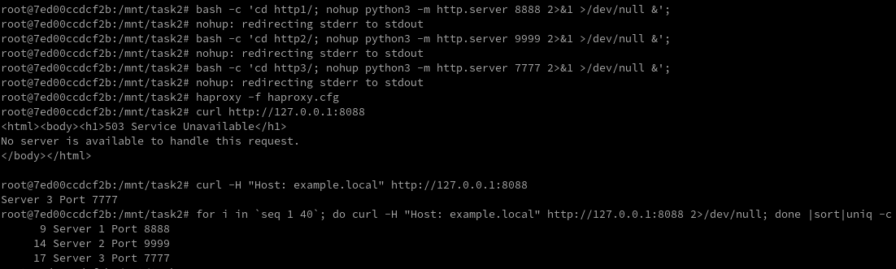

# Домашнее задание к занятию "Кластеризация и балансировка нагрузки" - `Фамилия и имя студента`

### Задание 1

Из оригинального конфига нужно было убрать "option	httplog" секции "defaults" и добавить опции "mode tcp", "balance roundrobin" в секцию "listen web_tcp".

1. Перейдите в каталог с лабараторной работой.
2. Запустите два http сервера на python c отвязкой от терминала, каждый в своём каталоге.
3. Запустите haproxy с приложенным конфигом.
4. Проверьте работоспособность системы и круглого робина пару раз выполнив запрос.
5. Завершите работу сервисов

```bash
### Старт сервисов
cd task1
bash -c 'cd http1/; nohup python3 -m http.server 8888 2>&1 >/dev/null &';
bash -c 'cd http2/; nohup python3 -m http.server 9999 2>&1 >/dev/null &';
haproxy -f haproxy.cfg

### Проверка результата
curl http://127.0.0.1:1325
curl http://127.0.0.1:1325

### Остановка сервисов
killall python3 haproxy
```

`

### Задание 2

В оригинальном конфиге необходимо скорректировать домен в опции "ACL" секции "frontend example", заменив условие срабатывания с "hdr(host) -i example.com" на требуемое "hdr(host) -i example.local". Так же требуется добавить 3й сервер и добавить всем серверам веса в секции "backend web_servers".

Важно! При обращении к серверу с именем example.local его нужно либо прописать в /etc/hosts, либо явно указать в качестве заговка "Host:" в обращении командой curl. Без указания имени хоста haproxy вернёт 503, т.к. в секции "frontend example" закомментирована опция "#default_backend web_servers".

1. Перейдите в каталог с лабараторной работой.
2. Запустите три http сервера на python c отвязкой от терминала, каждый в своём каталоге.
3. Запустите haproxy с приложенным конфигом.
4. Проверьте работоспособность системы и круглого робина с весами выполнив запрос множество раз.
5. Завершите работу сервисов

```bash
### Старт сервисов
cd task2
bash -c 'cd http1/; nohup python3 -m http.server 8888 2>&1 >/dev/null &';
bash -c 'cd http2/; nohup python3 -m http.server 9999 2>&1 >/dev/null &';
bash -c 'cd http3/; nohup python3 -m http.server 7777 2>&1 >/dev/null &';
haproxy -f haproxy.cfg 

### Проверка результата
curl http://127.0.0.1:8088
curl -H "Host: example.local" http://127.0.0.1:8088
for i in `seq 1 40`; do curl -H "Host: example.local" http://127.0.0.1:8088 2>/dev/null; done |sort|uniq -c

### Остановка сервисов
killall python3 haproxy
```

`


